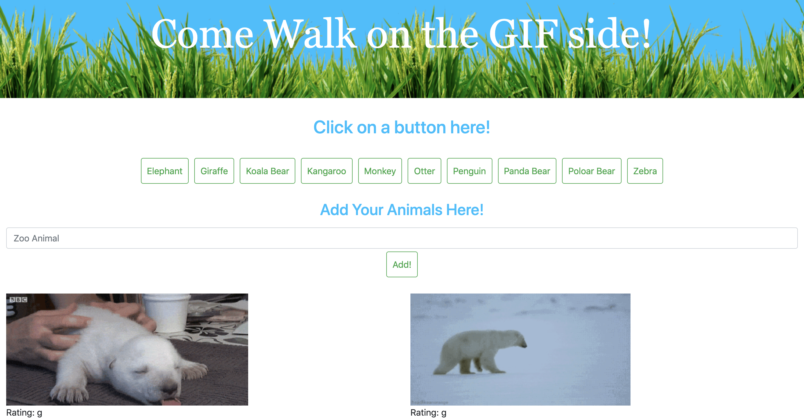

# giphyAPI GIFtastic App

### About my App:

This app uses the GIPHY API to create a dynamic website that populates with gifs of zoo animals of your choice.

### How My GIFtastic App Works

* Click on any button to populate 10 gifs of that specific zoo animal.
* Next, click on any zoo animal gif to play, and click again to pause it.
* Finally, type any zoo animal you would like into the form provided and hit Add! to create a new button of a zoo animal of your choice.

### Technologies Used for this Website:

* Bootstrap, 
* JQuery, 
* AJAX, and
* GIPHY API.

### Thank you for visiting my GitHub!
Enjoy using my app here: https://lucyq19.github.io/giphyAPI/

If you like this app, you may enjoy using more of my apps here: https://lucyq19.github.io/professionalPortfolio/